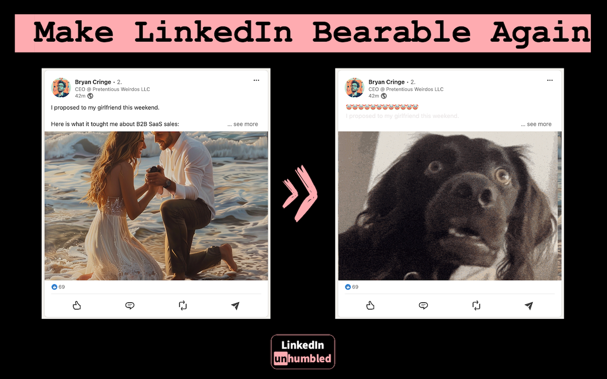

# LinkedIn unhumbled

> Make LinkedIn bearable again.

A Chrome extension that takes the cringe out of your LinkedIn feed:

- 🤡 **Word filter** — posts containing trigger words ("humbled", "proud", "blessed", "thrilled" — fully customizable) get prefixed with clown / 😌 / 💩 emojis and greyed out.
- 🐶 **Cringe-image overlay** — self-promotional headshots get covered with a confused-dog GIF.
- 🔒 **Zero network calls** — image classification runs entirely on your device via MediaPipe BlazeFace + WebAssembly. No servers, no API keys, no telemetry.



## Install

### Chrome Web Store
*(Coming soon — link will go here once published.)*

### From source (development)

1. Clone or download this repository.
2. Open `chrome://extensions`.
3. Toggle **Developer mode** (top right).
4. Click **Load unpacked** and select this repository's root folder.
5. Visit [linkedin.com/feed/](https://www.linkedin.com/feed/).

The extension's options page opens automatically on first install. Choose your filter words, prefix emoji, and dog-image variant. Defaults work out of the box.

## Privacy

This extension does not have a backend. It does not phone home. It does not have an API key. It does not log image URLs anywhere. It does not include any analytics SDK.

When you scroll your feed:
- A content script identifies post images by their URL pattern (`feedshare-shrink_*`, `image-shrink_*`).
- The extension's offscreen document fetches each image *from LinkedIn's CDN that already served it to you*, decodes it locally, and runs Google's MediaPipe BlazeFace model in WebAssembly to count faces and measure the largest face's bounding box.
- If exactly one or two faces are detected, the largest is high-confidence (≥ 0.7), and its bounding box covers ≥ 2% of the image, the image is classified `selfpromotional_image` and the dog GIF is overlaid.

See [PRIVACY.md](PRIVACY.md) for the full data-flow summary and [SECURITY.md](SECURITY.md) for the threat model and reporting.

## How it works

```
LinkedIn page
  └─> content script               finds post text + images, owns the overlay UI
        └─ chrome.runtime.sendMessage({type:'classifyImage', url})
             └─> service worker    LRU caches by URL, ensures offscreen doc exists
                   └─> offscreen   long-lived MediaPipe + BlazeFace host
                         └─ fetch → ImageBitmap → detect → reply
```

Classification cold start (first image after extension load) is ~3-8 seconds (loads ~11 MB MediaPipe WASM + 230 KB BlazeFace model). Subsequent classifications are ~5-30 ms on Apple Silicon.

The text-mod path matches `main [role="listitem"] p` — a structural selector that survives LinkedIn's hashed CSS class rotation. Images use URL patterns for the same reason.

## Configuration

Open the options page from the extension's popup, or navigate to:
`chrome-extension://<EXTENSION-ID>/src/settings/settings.html`

| Setting | What it does |
|---|---|
| **Filter words** | Comma-separated list. Posts whose visible text contains any word get the prefix treatment. |
| **Emoji injection** | Choose between 😌, 🤡, 💩, or off. Repeated 13× before the post body. |
| **Cringe image** | Animated dog GIF or static dog PNG, overlaid at 50% opacity over detected headshots. Click overlay to dismiss. |

## Tech stack

- Chrome Manifest V3 (offscreen API, service worker, content script)
- Vanilla JavaScript — no bundler, no build step
- [@mediapipe/tasks-vision](https://www.npmjs.com/package/@mediapipe/tasks-vision) v0.10.35 (Apache 2.0, vendored)
- BlazeFace short-range face detector (Apache 2.0, vendored)

## Browser compatibility

Tested on recent Chrome on macOS. Should work on any Chromium-based browser (Edge, Brave, Opera, Arc) that supports MV3 + the offscreen API + WebAssembly SIMD.

Not tested on Firefox; Firefox uses a different MV3 dialect and the offscreen API is not yet supported there.

## Limitations

- **LinkedIn's DOM changes regularly.** Selectors are kept robust (URL patterns, `[role="listitem"]`) but breakage is possible. Open an issue if the extension stops marking posts.
- **BlazeFace tuning is a heuristic.** False positives (group photos) and false negatives (small headshots) happen. Tune thresholds in `src/offscreen/offscreen.js` if you want different behavior.
- **No Firefox support yet.**

## Contributing

See [CONTRIBUTING.md](CONTRIBUTING.md). PRs welcome — especially for selector resilience, additional language packs, and Firefox port.

## License

[MIT](LICENSE) for the extension itself.

Vendored dependencies retain their original licenses (Apache 2.0 for MediaPipe Tasks Vision and the BlazeFace model). See [NOTICE](NOTICE).
