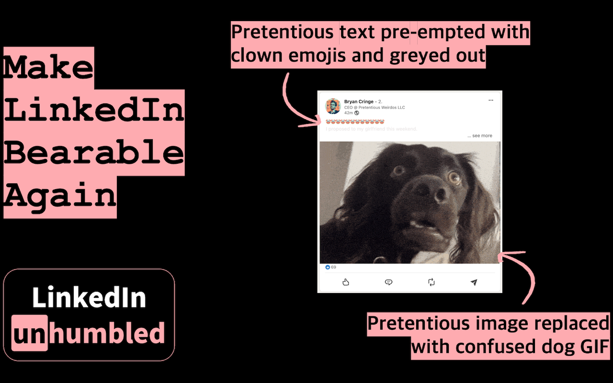

# linkedin unhumbled

make linkedin bearable again.

[install from the chrome web store](https://chromewebstore.google.com/detail/linkedin-unhumbled/mbnjnemapiheibpchdcgjkmkbcckkikp)


## what it does

- finds posts saying things like "humbled", "proud", "blessed", and "thrilled"
- adds your chosen emoji prefix and fades the post a bit, because subtlety left the room
- spots likely solo headshot posts and puts a confused dog over them
- lets you pick words, emoji, and dog mode in the options page



## no external llm

there is no server, no api key, no analytics, and no external llm.

image checks happen on your device with a bundled mediapipe blazeface model. the extension fetches linkedin image bytes that your browser already loaded, decodes them locally, counts faces, checks the biggest face area, then decides whether the dog should clock in.

```text
linkedin feed
  |
  v
content script
  |  finds post text + linkedin image urls
  v
service worker
  |  caches image results by url
  v
offscreen page
  |  bundled mediapipe wasm + blazeface model
  v
local face detection
  |  faces <= 2, score >= 0.7, area >= 2%
  v
dog overlay or leave it alone
```

## install from source

1. clone or download this repo.
2. open `chrome://extensions`.
3. turn on developer mode.
4. click load unpacked and select this repo.
5. open `https://www.linkedin.com/feed/`.

## privacy

preferences are stored in `chrome.storage.sync`: filter words, emoji choice, and dog choice. chrome may sync those settings through your google account if sync is enabled.

the extension does not collect browsing history, cookies, linkedin messages, credentials, or post data. see [privacy.md](PRIVACY.md) and [security.md](SECURITY.md) for the less snack-sized version.

## stack

- chrome manifest v3
- plain javascript, no build step
- vendored `@mediapipe/tasks-vision` v0.10.35
- bundled blazeface short-range face detector

## limits

- linkedin changes its dom whenever it gets bored.
- blazeface is a heuristic, not a vibes court.
- firefox is not supported yet.

## license

mit for this extension. vendored dependencies keep their own licenses. see [notice](NOTICE).
